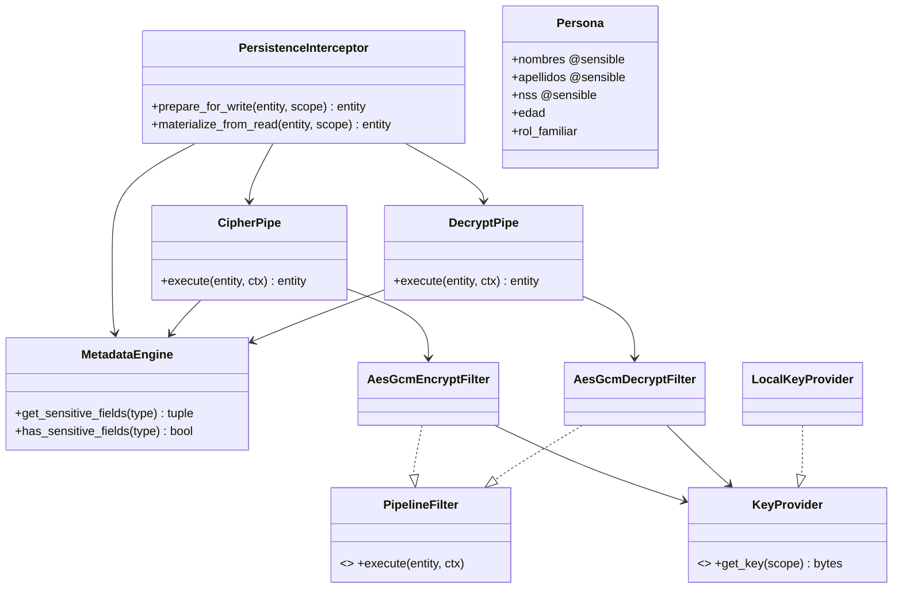
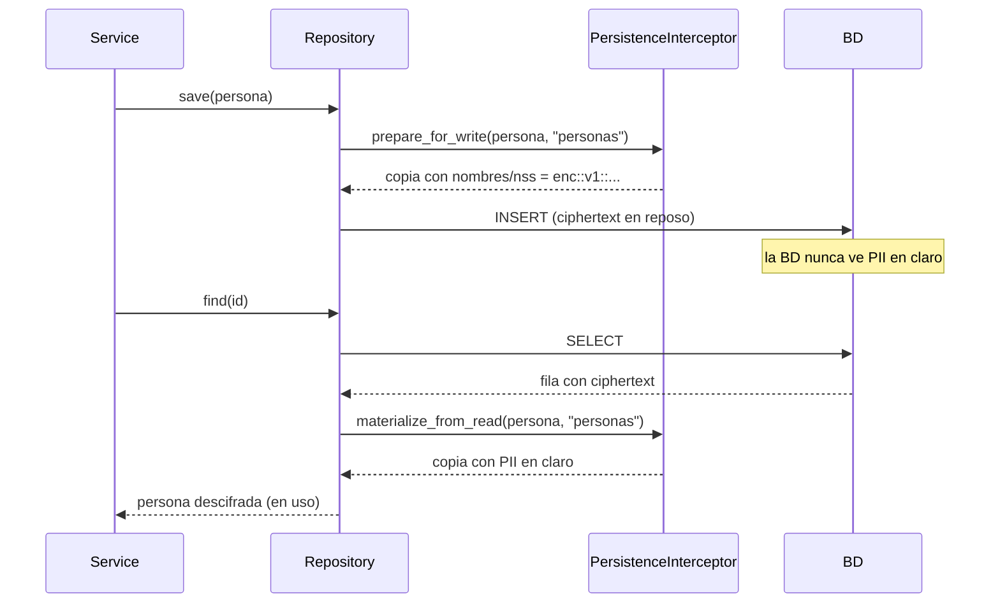

# Cifrado de Datos Sensibles — CogniFit (Entregable #4)

Implementación del **proceso de cifrado en reposo / descifrado en uso** visto en
clase, aplicado al backend. Cubre **HU-BD-11** (protección de datos de menores) y
**HU-BK-14 / HU-BD-10** (no exponer PII).

> Endurecimiento respecto al demo: el motor usa **AES-256-GCM** (cifrado
> autenticado) en lugar del XOR de stream del ejemplo. La clave se deriva **por
> scope** y el scope se liga como **AAD**, de modo que un ciphertext de una tabla
> no es válido en otra.

## 1. Patrón (igual al pizarrón)

```
DTO --mapper--> Entity(@sensible)
                    │  prepare_for_write
                    ▼
        PersistenceInterceptor ── CipherPipe ─> [Cipher Filter AES-GCM] ─> Repository ─> BD
                    ▲                                                                       │
                    │  materialize_from_read                                               │
        PersistenceInterceptor ── DecryptPipe ─> [Decrypt Filter AES-GCM] <── Repository <─┘
```

- **`@sensible`** ([decorators.py](../api/security/encryption/pipeline/decorators.py)): marca declarativa de los campos a cifrar (metadata de dataclass).
- **MetadataEngine** ([metadata_engine.py](../api/security/encryption/pipeline/metadata_engine.py)): descubre y cachea los campos sensibles por tipo.
- **PersistenceInterceptor** ([interceptor.py](../api/security/encryption/pipeline/interceptor.py)): punto único; cifra antes de persistir, descifra al leer. Trabaja sobre una **copia** (no muta el objeto de dominio).
- **CipherPipe / DecryptPipe** ([pipes/](../api/security/encryption/pipeline/pipes/)): cadena de filtros (PIPE). Filtros intercambiables.
- **KeyProvider** ([key_provider.py](../api/security/encryption/pipeline/key_provider.py)): deriva clave AES-256 por scope; rechaza claves inseguras en producción.

## 2. Diagrama de clases



## 3. Flujo de escritura y lectura



## 4. Motor criptográfico

- **Algoritmo**: AES-256-GCM (`cryptography`), autenticado (integridad + confidencialidad).
- **Clave**: derivada por scope — `SHA-256(master || ':' || scope)` (32 bytes). La
  *master key* sale de `FIELD_ENCRYPTION_KEY` (o `DB_ENCRYPTION_KEY`); en un entorno
  real vendría de un KMS.
- **Nonce**: 12 bytes aleatorios por valor (dos cifrados del mismo texto dan tokens distintos).
- **AAD**: el `scope` (tabla) → un ciphertext no se puede mover de tabla.
- **Formato**: `enc::v1::base64url(nonce || ciphertext+tag)`. Idempotente (no recifra) y resiliente (ignora valores ya en claro al leer).

## 5. Cómo se integra en un repositorio

```python
class PersonaRepository:
    def __init__(self, interceptor: PersistenceInterceptor) -> None:
        self._itc = interceptor

    def save(self, persona: Persona) -> Persona:
        at_rest = self._itc.prepare_for_write(persona, scope="personas")
        # ... INSERT con at_rest.nombres (ya cifrado) ...

    def find(self, id) -> Persona:
        row = ...  # SELECT
        return self._itc.materialize_from_read(row_as_persona, scope="personas")
```
El interceptor se obtiene con `build_persistence_interceptor()` (lee la config) y se
inyecta por DI como el resto de servicios.

## 6. Verificación (ejecutada)

Pruebas en [test_encryption_pipeline.py](../api/tests/unit/test_encryption_pipeline.py):
cifrado solo de campos sensibles, round-trip, no-mutación del original, idempotencia,
fallo con scope incorrecto (AAD) y rechazo de clave insegura en producción. **Todas pasan.**

## 7. Relación con el cifrado ya existente (pgcrypto)

Hoy `academic.students.full_name` se cifra **a nivel de BD** con `pgcrypto`
(`pgp_sym_encrypt/decrypt`). Ese es cifrado-en-reposo del lado servidor de Postgres.
Este pipeline es el patrón **del lado de aplicación** (el enseñado en clase):
desacopla el cifrado del SQL, es declarativo (`@sensible`) y portable a cualquier
almacenamiento. Es el mecanismo recomendado para nuevas entidades con PII y puede
sustituir progresivamente al cifrado inline.
