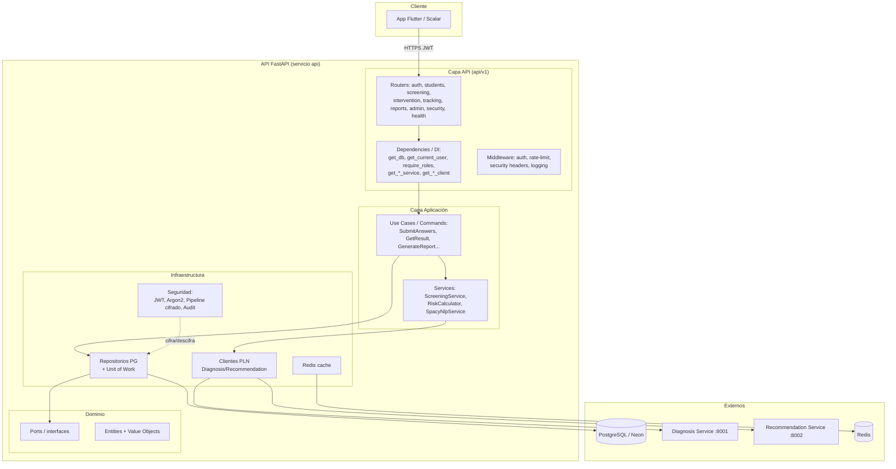
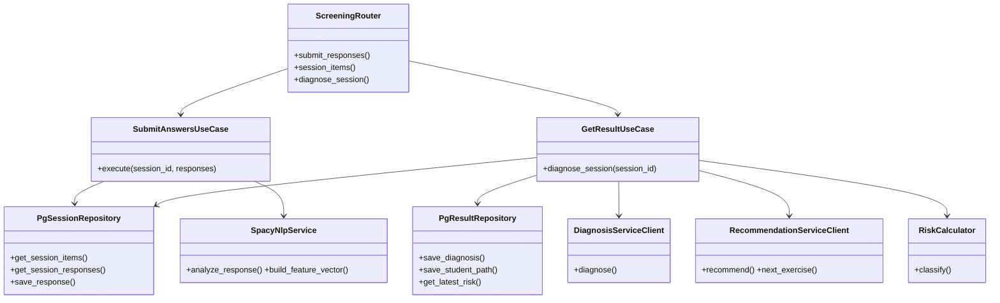
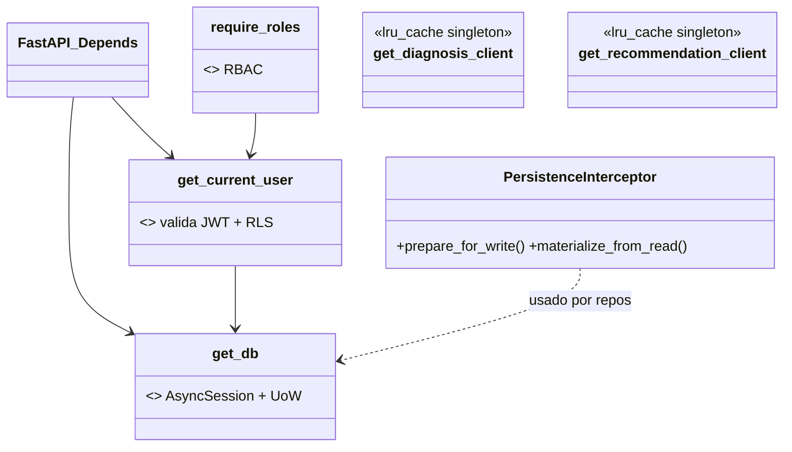
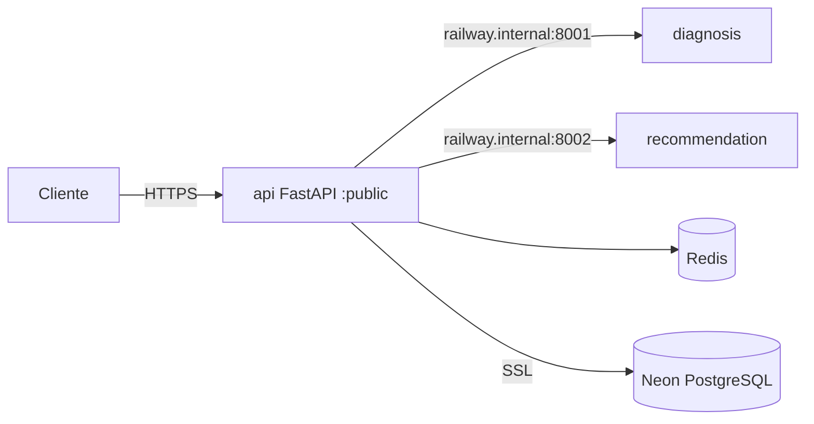

# Diseño Visual de la API — CogniFit Backend (Entregable #2)

Diagramas de la implementación entregada del backend (FastAPI, arquitectura
hexagonal / por capas). Render con Mermaid.

## 1. Diagrama de componentes (contenedores y capas)

## 2. Diagrama de clases — slice de Screening/Diagnóstico

## 3. Diagrama de clases — Inyección de dependencias y seguridad

## 4. Despliegue (Railway, 1 proyecto)

> Detalle de cada componente y sus patrones en
> [DOC_DISENO_BACKEND.md](DOC_DISENO_BACKEND.md). El módulo de cifrado tiene su
> propio diagrama de clases en [CIFRADO_DATOS_SENSIBLES.md](CIFRADO_DATOS_SENSIBLES.md).
